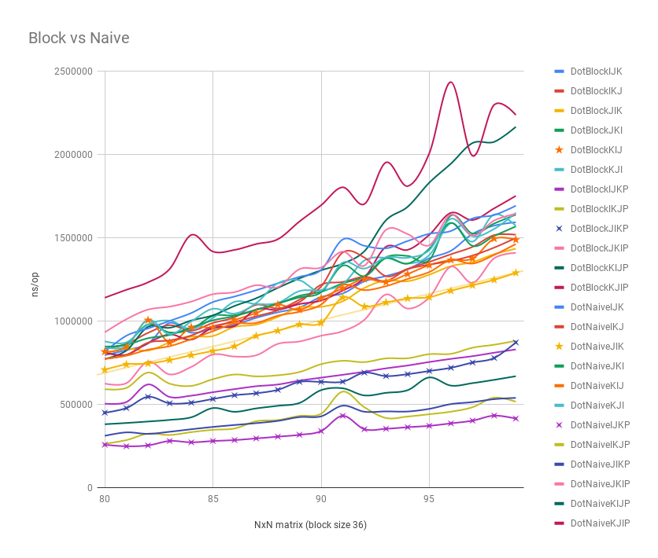

# Benchmarks

This document illustrates the general benchmark results of `mat`.

Matrix operation is highly tricky and hardware specific.
As a caller, it is your responsbility to measure the performance of various APIs 
provided by this package on your platform and choose the best solution.

`mat` wraps the fastest version based on the following benchmark results, for instance:
`Matrix.DotNaive` wraps `Matrix.DotNaiveJIK` and etc.

## Hardware & Software

The following results are based on the following hardware and software:

```bash
→ system_profiler SPHardwareDataType
Hardware:

    Hardware Overview:

      Model Name: MacBook Pro
      Model Identifier: MacBookPro11,3
      Processor Name: Intel Core i7
      Processor Speed: 2.5 GHz
      Number of Processors: 1
      Total Number of Cores: 4
      L2 Cache (per Core): 256 KB
      L3 Cache: 6 MB
      Memory: 16 GB
```

```bash
→ go env
GOARCH="amd64"
GOBIN=""
GOCACHE="/Users/changkun/Library/Caches/go-build"
GOEXE=""
GOFLAGS=""
GOHOSTARCH="amd64"
GOHOSTOS="darwin"
GOOS="darwin"
GOPATH="/Users/changkun/dev/simplelab"
GOPROXY=""
GORACE=""
GOROOT="/usr/local/Cellar/go/1.11/libexec"
GOTMPDIR=""
GOTOOLDIR="/usr/local/Cellar/go/1.11/libexec/pkg/tool/darwin_amd64"
GCCGO="gccgo"
CC="clang"
CXX="clang++"
CGO_ENABLED="1"
GOMOD=""
CGO_CFLAGS="-g -O2"
CGO_CPPFLAGS=""
CGO_CXXFLAGS="-g -O2"
CGO_FFLAGS="-g -O2"
CGO_LDFLAGS="-g -O2"
PKG_CONFIG="pkg-config"
GOGCCFLAGS="-fPIC -m64 -pthread -fno-caret-diagnostics -Qunused-arguments -fmessage-length=0 -fdebug-prefix-map=/var/folders/6f/8fw9lcrs5w153s5skflndq7w0000gn/T/go-build538906347=/tmp/go-build -gno-record-gcc-switches -fno-common"
```

```
→ lstopo
Machine (16GB total)
  Package L#0
    NUMANode L#0 (P#0 16GB)
    L3 L#0 (4096KB)
      L2 L#0 (256KB) + L1d L#0 (32KB) + L1i L#0 (32KB) + Core L#0
        PU L#0 (P#0)
        PU L#1 (P#1)
      L2 L#1 (256KB) + L1d L#1 (32KB) + L1i L#1 (32KB) + Core L#1
        PU L#2 (P#2)
        PU L#3 (P#3)
  CoProc(OpenCL) "opencl0d1"
```

## Matrix Multiplication: Naive v.s. Naive with concurrency v.s. Vanilla block v.s. Block with concurrency


