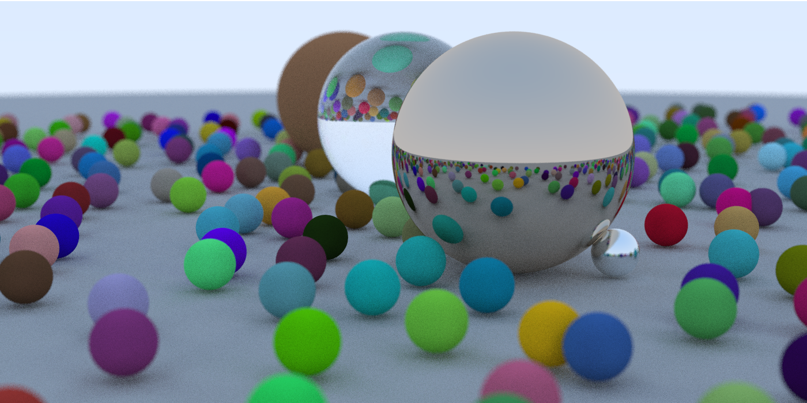

# ray

ray tracer in Go



## Try

```go
go run .
```

## Acknoledgements

Many thanks to Peter Shirley's [Ray Tracking Book Series](https://github.com/RayTracing/raytracing.github.io).

## License

MIT &copy; 2019 [changkun](https://changkun.de)